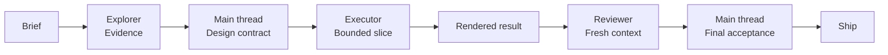

<p align="center">
  
</p>

<p align="center">
  <a href="./USAGE.md">Usage</a> ·
  <a href="./skills/team-mode/SKILL.md">Team Mode</a> ·
  <a href="./skills/apple-design/SKILL.md">Apple craft</a> ·
  <a href="./DESIGN.md">Design system</a>
</p>

<p align="center">
  
  
  
</p>

SevenDesign is a product-minded design operating system for AI agents and frontend teams.

It turns a loose product brief into a distinct visual direction, a coherent interface system, and a reviewable implementation path — with Apple-style fluid interaction and a deliberate Explorer / Executor / Reviewer team model.

## Start here

If you have five minutes:

1. Read [`USAGE.md`](./USAGE.md).
2. Choose one direction in [`quickstart/CHOOSE-YOUR-STACK.md`](./quickstart/CHOOSE-YOUR-STACK.md).
3. Give an agent [`DESIGN.md`](./DESIGN.md), [`TOKENS.md`](./TOKENS.md), [`skills/design-core/SKILL.md`](./skills/design-core/SKILL.md), and one matching context skill.
4. Use [`PRE-FLIGHT-CHECKLIST.md`](./PRE-FLIGHT-CHECKLIST.md) before calling the result done.

For a substantial task, add [`skills/team-mode/SKILL.md`](./skills/team-mode/SKILL.md) and the local routing guide in [`skills/team-mode/references/seven-design-routing.md`](./skills/team-mode/references/seven-design-routing.md).

## The core loop



Team Mode is value-based, not mandatory. A small token or copy edit stays in the main thread. Parallel work is reserved for independent evidence, bounded implementation, or fresh review with a clear quality benefit.

## Why it exists

Most generated interfaces are technically complete but visually interchangeable. SevenDesign makes the decisions explicit:

- **Direction before decoration** — choose the product voice, density, warmth, layout variance, and page archetype first.
- **Systems over screenshots** — use semantic tokens, real states, reusable primitives, and believable content.
- **Motion with a reason** — use fluid, interruptible motion for feedback, continuity, orientation, and explanation; remove it from high-frequency work.
- **One visual DNA** — the hero, workspace, docs, pricing, and responsive states should feel authored by the same product team.
- **Review earns approval** — check the rendered result, focus, responsive behavior, reduced motion, and generic AI patterns before shipping.

## Pick the right layer

| Layer | Use it for | Start with |
| --- | --- | --- |
| Foundation | principles, architecture, tokens, page composition | [`DESIGN.md`](./DESIGN.md) · [`TOKENS.md`](./TOKENS.md) |
| Core execution | inspect → direct → build → verify | [`skills/design-core/SKILL.md`](./skills/design-core/SKILL.md) |
| Craft | UI polish, component feel, animation decisions | [`emil-design-eng`](./skills/emil-design-eng/SKILL.md) |
| Fluid interaction | gestures, springs, momentum, typography, materials | [`apple-design`](./skills/apple-design/SKILL.md) |
| Context | AI, developer tools, docs/pricing, premium launches | [`skills/`](./skills) |
| Team | evidence, bounded execution, fresh review | [`team-mode`](./skills/team-mode/SKILL.md) |
| Guardrails | anti-slop, quality, accessibility, buildability | [`FORBIDDEN-PATTERNS.md`](./FORBIDDEN-PATTERNS.md) · [`PRE-FLIGHT-CHECKLIST.md`](./PRE-FLIGHT-CHECKLIST.md) |

## Choose a context skill

| You are building… | Use |
| --- | --- |
| AI chat, agent builder, copilot, multimodal tool | [`ai-native`](./skills/ai-native/SKILL.md) |
| API platform, infrastructure console, technical dashboard | [`devtool-pro`](./skills/devtool-pro/SKILL.md) |
| Documentation, help center, onboarding, pricing | [`docs-pricing`](./skills/docs-pricing/SKILL.md) |
| Launch page, hardware reveal, automotive, prestige product | [`luxe-landing`](./skills/luxe-landing/SKILL.md) |
| Personal site | [`apple-design`](./skills/apple-design/SKILL.md) + [`luxe-landing`](./skills/luxe-landing/SKILL.md) |

## The craft baseline

SevenDesign vendors the original design-engineering skills from [`attentiondotnet/emilkowalski_skills`](https://github.com/attentiondotnet/emilkowalski_skills):

- [`emil-design-eng`](./skills/emil-design-eng/SKILL.md) — high-craft UI polish and motion decisions
- [`apple-design`](./skills/apple-design/SKILL.md) — response, direct manipulation, springs, momentum, materials, typography, and reduced motion
- [`animation-vocabulary`](./skills/animation-vocabulary/SKILL.md) — precise language for describing motion
- [`review-animations`](./skills/review-animations/SKILL.md) — strict motion review and verdicts

The upstream files remain intact; SevenDesign adds local product context and routing around them. See [`skills/UPSTREAM-SOURCE.md`](./skills/UPSTREAM-SOURCE.md).

## What is included

- Presets for AI-native, developer-tool, warm SaaS, creative motion, fintech trust, luxe performance, and productized framework directions.
- Brand references for Apple, Linear, Notion, Stripe, Supabase, Vercel, Tesla, and Runway.
- Page archetypes for landing heroes, dashboards, AI workspaces, docs, pricing, framework homepages, and more.
- Component recipes and copyable Tailwind / shadcn / Radix examples.
- A Team Mode routing contract with dispatch packets, one-writer ownership, fresh review, runtime readiness gates, and failure recovery.
- A small [`personal-site/`](./personal-site/) Apple-inspired homepage prototype.

## A usable prompt

```text
Use $team-mode and $design-core for this task.

Build a responsive AI workspace for technical teams.
Use $ai-native for product states, $emil-design-eng for UI craft,
and $apple-design for sheets, gestures, and interruptible motion.

First gather evidence from DESIGN.md, TOKENS.md, the AI-native preset,
the AI workspace archetype, and the existing component recipes.
Keep unresolved product and visual decisions in the main thread.
Implement only after the design contract and acceptance checks are clear.
Finish with rendered desktop/mobile checks and a fresh motion/accessibility review.
```

## Implementation

For real frontend work, use the provided tokens and examples instead of inventing a parallel system:

- [`implementation/TAILWIND-THEME.md`](./implementation/TAILWIND-THEME.md)
- [`implementation/COMPONENT-MAPPING.md`](./implementation/COMPONENT-MAPPING.md)
- [`implementation/SHADCN-GUIDE.md`](./implementation/SHADCN-GUIDE.md)
- [`examples/`](./examples)

The library is framework-agnostic in principle. Tailwind CSS, shadcn/ui, and Radix are the reference implementation stack.

## Quality gate

Before shipping a design, run the [pre-flight checklist](./PRE-FLIGHT-CHECKLIST.md). In particular:

- make the product task and next action obvious;
- preserve hero/interior visual continuity;
- define hover, pressed, focus-visible, disabled, loading, empty, and error states;
- respect `prefers-reduced-motion`, `prefers-reduced-transparency`, and touch input;
- remove animation from high-frequency keyboard actions;
- inspect the actual rendered result at wide and narrow sizes;
- reject generic SaaS, fake-terminal, glow-first, and fake-premium patterns.

## Contributing

Add a brand, archetype, component recipe, preset, implementation example, or skill only when it teaches a reusable decision. Follow [`CONTRIBUTING.md`](./CONTRIBUTING.md) and keep new material product-specific.

## License

The SevenDesign library is MIT licensed. Vendored upstream sources retain their own notices in [`skills/EMILKOWALSKI-LICENSE.txt`](./skills/EMILKOWALSKI-LICENSE.txt) and [`skills/TEAM-MODE-LICENSE.txt`](./skills/TEAM-MODE-LICENSE.txt).
