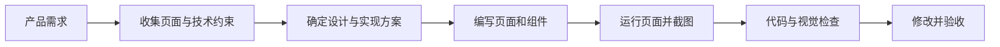

<p align="center">
  
</p>

<p align="center">
  <strong>SEVENDESIGN</strong><br>
  面向 AI 智能体与前端团队的设计、实现和复审 Skill
</p>

<p align="center">
  <a href="./skills/seven-design/SKILL.md">主入口</a> ·
  <a href="./USAGE.md">使用指南</a> ·
  <a href="./skills/component-intelligence/SKILL.md">组件选型</a> ·
  <a href="./skills/react-bits/SKILL.md">React Bits / Vue Bits</a> ·
  <a href="./skills/team-mode/SKILL.md">团队模式</a> ·
  <a href="./DESIGN.md">设计系统</a>
</p>

<p align="center">
  
  
  
  
</p>

SEVENDESIGN 是一组用于 AI 智能体和前端项目的设计与实现规范。它提供设计原则、页面预设、组件选型、动效规则、代码复审和视觉检查。

它的工作方式是：先理解产品任务，再确定页面结构、视觉方向和技术来源，最后通过代码检查与页面截图验证结果。React 是默认实现框架；项目使用 Vue 或 Nuxt 时，可以切换到 Vue Bits。

## 安装与入口

[`skills/seven-design/SKILL.md`](./skills/seven-design/SKILL.md) 是统一入口，会根据任务加载需要的技能、参考文档和组件目录。其他 `skills/*/SKILL.md` 也可以单独安装。

使用 Codex Skill 安装器时，选择总入口路径：

```text
--path skills/seven-design
```

如果需要完整套件，可以同时安装 `skills/design-core`、`skills/component-intelligence`、`skills/react-bits`、`skills/apple-design`、`skills/emil-design-eng`、`skills/review-animations` 和 `skills/team-mode`。只安装统一入口也可以开始工作，但未安装的配套 Skill 不会被加载。

## 快速开始

如果你刚开始使用：

1. 先阅读 [`skills/seven-design/SKILL.md`](./skills/seven-design/SKILL.md) 和 [`USAGE.md`](./USAGE.md)。
2. 在 [`quickstart/CHOOSE-YOUR-STACK.md`](./quickstart/CHOOSE-YOUR-STACK.md) 中选择一条方向。
3. 将 [`DESIGN.md`](./DESIGN.md)、[`TOKENS.md`](./TOKENS.md)、[`skills/design-core/SKILL.md`](./skills/design-core/SKILL.md) 和 [`skills/component-intelligence/SKILL.md`](./skills/component-intelligence/SKILL.md) 提供给智能体。
4. 根据任务加入一个上下文 Skill，例如 [`ai-native`](./skills/ai-native/SKILL.md) 或 [`devtool-pro`](./skills/devtool-pro/SKILL.md)。
5. 只有在组件选型结果需要 React Bits 或 Vue Bits 时，才加入 [`skills/react-bits/SKILL.md`](./skills/react-bits/SKILL.md)。
6. 交付前运行 [`PRE-FLIGHT-CHECKLIST.md`](./PRE-FLIGHT-CHECKLIST.md) 和对应的动效复审。

较大的任务可以再加入 [`skills/team-mode/SKILL.md`](./skills/team-mode/SKILL.md) 及其 [`路由指南`](./skills/team-mode/references/seven-design-routing.md)。

## 质量验证

SevenDesign 提供三类验证工具：

1. [`benchmarks/`](./benchmarks/)：20 个覆盖 AI SaaS、Dashboard、Landing Page、Editor、Admin、Portfolio、Mobile Web、Documentation、Pricing 和 AI Workspace 的任务，用于测试组件选型是否合理。
2. [`visual-qa`](./skills/visual-qa/SKILL.md)：对可运行页面执行桌面端、移动端和 reduced-motion 截图检查，并根据结果修改页面。
3. [`resolve-context.py`](./skills/seven-design/scripts/resolve-context.py)：只加载当前任务需要的 Skill、Reference 和 Catalog，避免每次读取完整 registry、`llms.txt` 和无关源码。

Benchmark 分数只代表决策规则是否通过。只有完成真实页面截图、响应式、无障碍和实现验证后，才能报告完整质量分。

## 工作流程



小型文案、token 或局部组件修改可以直接在主线程完成。只有在需要独立调研、并行实现或全新上下文复审时，才使用团队模式。

## 适合解决的问题

- 先确定产品定位、信息层级和页面结构，再开始写界面。
- 为 AI 产品、开发者工具、文档、定价页、发布页和个人网站建立统一视觉规则。
- 从宿主系统、shadcn/ui、Radix UI、React Bits 和 Vue Bits 中选择合适的实现来源。
- 为 reveal、focus、feedback、state、media 和 showcase 等明确任务配置动效。
- 检查悬停、按下、焦点、禁用、加载、空状态和错误状态。
- 通过桌面端、移动端、键盘操作、reduced-motion 和真实截图复审交付结果。

## 能力分层

| 层级 | 适用场景 | 从这里开始 |
| --- | --- | --- |
| 基础 | 原则、架构、token、页面构成 | [`DESIGN.md`](./DESIGN.md) · [`TOKENS.md`](./TOKENS.md) |
| 核心执行 | 检查、定向、构建和验证 | [`design-core`](./skills/design-core/SKILL.md) |
| 组件选型 | 根据产品任务分配基础组件、交互行为和视觉表达 | [`component-intelligence`](./skills/component-intelligence/SKILL.md) |
| UI 与动效 | UI 精修、交互反馈和动效决策 | [`emil-design-eng`](./skills/emil-design-eng/SKILL.md) |
| Apple 交互 | 手势、弹簧、惯性、材质、字体和减少动效 | [`apple-design`](./skills/apple-design/SKILL.md) |
| Bits 组件 | React Bits / Vue Bits 的公开组件和动效表达 | [`react-bits`](./skills/react-bits/SKILL.md) |
| 动效复审 | 产品级编排和代码级审查 | [`motion-review`](./skills/motion-review/SKILL.md) · [`review-animations`](./skills/review-animations/SKILL.md) |
| 团队模式 | 调研、实现、复审和任务路由 | [`team-mode`](./skills/team-mode/SKILL.md) |
| 质量防线 | 反套路、无障碍、可构建性和交付检查 | [`FORBIDDEN-PATTERNS.md`](./FORBIDDEN-PATTERNS.md) · [`PRE-FLIGHT-CHECKLIST.md`](./PRE-FLIGHT-CHECKLIST.md) |

## 选择上下文技能

| 你正在构建…… | 使用 |
| --- | --- |
| AI 对话、智能体构建器、副驾驶、多模态工具 | [`ai-native`](./skills/ai-native/SKILL.md) |
| API 平台、基础设施控制台、技术仪表盘 | [`devtool-pro`](./skills/devtool-pro/SKILL.md) |
| 文档、帮助中心、引导流程、定价页 | [`docs-pricing`](./skills/docs-pricing/SKILL.md) |
| 发布页、硬件展示、汽车、高端产品 | [`luxe-landing`](./skills/luxe-landing/SKILL.md) |
| 个人网站 | [`apple-design`](./skills/apple-design/SKILL.md) + [`luxe-landing`](./skills/luxe-landing/SKILL.md) |

## React Bits / Vue Bits

SevenDesign 默认使用 React。只有用户明确使用 Vue / Nuxt，或宿主项目已经使用 Vue 时，才切换到 Vue Bits。

React Bits 和 Vue Bits 由 [DavidHDev](https://github.com/DavidHDev) 创建和维护。SevenDesign 使用它们的公开组件和 registry 作为可选的动效与表达来源，不会默认加载所有组件。

每次任务选中 Bits 后，先运行一次上游检查：

```bash
python3 skills/react-bits/scripts/check-upstream.py --framework react
```

Vue / Nuxt 项目将 `react` 改为 `vue`。这个命令只检查远端最新 commit，不会克隆完整仓库，也不会加载完整 registry。若远端版本发生变化，再只读取当前任务命中的公开组件或 registry 条目；网络不可用时，使用本地固定快照并记录检查未完成。

### React Bits 公开资源

仓库内包含 React Bits 官方公开 registry 的固定版本快照，以及 6 组可以复制或适配的公开组件源码：

- [`AnimatedList-TS-CSS`](./skills/react-bits/catalog/components/AnimatedList-TS-CSS/)：列表或结果的低频出现
- [`BlurText-TS-CSS`](./skills/react-bits/catalog/components/BlurText-TS-CSS/)：标题、解释和 onboarding 的出现效果
- [`CountUp-JS-CSS`](./skills/react-bits/catalog/components/CountUp-JS-CSS/)：少量关键指标的数值变化
- [`FlowingMenu-JS-CSS`](./skills/react-bits/catalog/components/FlowingMenu-JS-CSS/)：导航或 showcase 的编排
- [`SpotlightCard-JS-CSS`](./skills/react-bits/catalog/components/SpotlightCard-JS-CSS/)：卡片的 pointer focus
- [`TiltedCard-JS-TW`](./skills/react-bits/catalog/components/TiltedCard-JS-TW/)：产品或媒体展示

### Vue Bits 公开资源

Vue Bits 当前是选择性公开快照，不是完整源码镜像。仓库内包含 2 组可以复制或适配的 Vue 组件：

- [`BlurText`](./skills/react-bits/catalog/vue/components/BlurText/)：短标题或能力说明的出现效果，依赖 `motion-v`
- [`SpotlightCard`](./skills/react-bits/catalog/vue/components/SpotlightCard/)：次级证明或 showcase 的 focus 效果，无额外依赖

Vue 资源入口是 [`skills/react-bits/catalog/vue/README.md`](./skills/react-bits/catalog/vue/README.md) 和 [`source-manifest.json`](./skills/react-bits/catalog/vue/source-manifest.json)。只有在框架判断为 Vue / Nuxt 后，才读取 Vue Bits 源码；不会把 React 源码静默改写成 Vue。

使用 Bits 时：

1. 先写清产品任务，再决定是否需要动效。
2. 让宿主系统、shadcn/ui 或 Radix UI 负责基础组件和交互行为，Bits 只负责适合它的视觉表达。
3. 优先读取本地固定版本公开目录。未内置的组件，再按官方公开 registry 的安装路径处理。
4. 根据任务使用 `micro`、`system` 或 `signature` 动效预算。默认每个 viewport 只保留一个 signature 动效。
5. 无法合法获得 Pro 时，只参考公开的分类、构图和工作流，不复制收费源码、私有素材或 gated template。

来源、commit、license 和刷新边界见 [`UPSTREAM.md`](./skills/react-bits/UPSTREAM.md)、[`REACT-BITS-LICENSE.md`](./skills/react-bits/REACT-BITS-LICENSE.md)、[`VUE-BITS-LICENSE.md`](./skills/react-bits/VUE-BITS-LICENSE.md) 和 [`frameworks.json`](./skills/react-bits/catalog/frameworks.json)。

默认只读取紧凑矩阵和命中的源码，不整份加载 registry 或 `llms.txt`。Token 控制规则见 [`token-budget.md`](./skills/react-bits/references/token-budget.md)。

## 设计与动效参考

SEVENDESIGN 使用 [`attentiondotnet/emilkowalski_skills`](https://github.com/attentiondotnet/emilkowalski_skills) 的公开设计工程技能，并在其基础上补充产品任务、路由和复审规则：

- [`emil-design-eng`](./skills/emil-design-eng/SKILL.md)：UI 精修和动效决策
- [`apple-design`](./skills/apple-design/SKILL.md)：响应、手势、弹簧、惯性、材质、字体和减少动效
- [`animation-vocabulary`](./skills/animation-vocabulary/SKILL.md)：动效描述词汇
- [`review-animations`](./skills/review-animations/SKILL.md)：动效代码复审

上游文件保持原样；SEVENDESIGN 只在其周围补充产品上下文与路由。详见 [`skills/UPSTREAM-SOURCE.md`](./skills/UPSTREAM-SOURCE.md)。

## 目录内容

- AI 原生、开发者工具、协作与效率类 SaaS、创意动效、金融信任、高端性能和产品框架预设。
- Apple、Linear、Notion、Stripe、Supabase、Vercel、Tesla 和 Runway 的品牌参考。
- 发布页、仪表盘、AI 工作区、文档、定价页、框架首页等页面原型。
- 可复用的组件配方，以及 Tailwind / shadcn / Radix 示例。
- Component Intelligence 的跨来源组件选型规则。
- React Bits / Vue Bits 的公开 registry 快照、公开组件源码、来源记录、动效分级和 Pro 使用边界。
- 团队模式的任务路由、并行协作、全新复审和失败恢复规则。
- [`personal-site/`](./personal-site/) 首页原型。

## 示例提示词

```text
请使用 $seven-design、$component-intelligence、$design-core 和 $team-mode。

为技术团队构建一个响应式 AI 工作区。
使用 $ai-native 处理产品状态，使用 $emil-design-eng 处理 UI，
使用 $apple-design 处理面板、手势和可中断动效。

先根据产品任务判断基础组件、交互行为和视觉表达的来源。
只有在公开 React Bits 组件适合承担 reveal、state、media 或 showcase 任务时，
才使用 $react-bits。最后用 $review-animations 复审动效代码。

先阅读 DESIGN.md、TOKENS.md、AI 原生预设、AI 工作区原型和现有组件配方。
设计和验收条件明确后再开始实现。
完成桌面端、移动端、无障碍和 reduced-motion 检查后再交付。
```

## 实现

进行真实前端工作时，请优先使用已有 token 和示例，不要另起一套平行系统：

- [`implementation/TAILWIND-THEME.md`](./implementation/TAILWIND-THEME.md)
- [`implementation/COMPONENT-MAPPING.md`](./implementation/COMPONENT-MAPPING.md)
- [`implementation/SHADCN-GUIDE.md`](./implementation/SHADCN-GUIDE.md)
- [`examples/`](./examples)

这套规范不绑定具体框架。Tailwind CSS、shadcn/ui 和 Radix UI 是参考实现技术栈。React Bits 的公开组件源码可以复制或适配到宿主项目，但本仓库不复制完整上游实现，也不包含 Pro、私有素材或 gated template。

## 交付前检查

交付前运行 [`PRE-FLIGHT-CHECKLIST.md`](./PRE-FLIGHT-CHECKLIST.md)，至少确认：

- 产品任务、主要行动和信息层级清楚。
- 首页与内部页面使用同一套视觉规则。
- 悬停、按下、焦点、禁用、加载、空状态和错误状态都有明确表现。
- 动效有触发条件，支持中断，并在 reduced-motion 下有降级方案。
- 键盘操作、触控输入、宽屏和窄屏都经过检查。
- 页面经过真实渲染和截图复审。

## 贡献

请先阅读 [`CONTRIBUTING.md`](./CONTRIBUTING.md)。新增内容应提供可复用的规则、示例或决策依据，并保持与现有目录结构一致。

感谢 [DavidHDev](https://github.com/DavidHDev) 创建和维护 [React Bits](https://github.com/DavidHDev/react-bits) 与 [Vue Bits](https://github.com/DavidHDev/vue-bits)。它们是 SevenDesign 的上游公开参考来源，不代表 DavidHDev 是本仓库的直接维护者或提交者。

## 当前状态

当前版本包含：

- AI 智能体和前端项目可使用的设计与实现 Skill
- 基于产品任务的组件选型规则
- React 默认、Vue / Nuxt 可选的公开 Bits 资源
- Benchmark、视觉 QA 和按需上下文加载工具
- 设计、动效、无障碍和实现复审规则

## 许可证

SEVENDESIGN 采用 MIT 许可证。引入的上游源文件保留各自的声明，详见 [`skills/EMILKOWALSKI-LICENSE.txt`](./skills/EMILKOWALSKI-LICENSE.txt)、[`skills/TEAM-MODE-LICENSE.txt`](./skills/TEAM-MODE-LICENSE.txt)、[`skills/react-bits/REACT-BITS-LICENSE.md`](./skills/react-bits/REACT-BITS-LICENSE.md) 和 [`skills/react-bits/VUE-BITS-LICENSE.md`](./skills/react-bits/VUE-BITS-LICENSE.md)。
