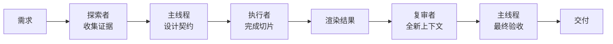

<p align="center">
  
</p>

<p align="center">
  <strong>SEVENDESIGN</strong><br>
  面向 AI Agent 与前端团队的设计系统、界面构建与质量复审 Skill
</p>

<p align="center">
  <a href="./USAGE.md">使用指南</a> ·
  <a href="./skills/team-mode/SKILL.md">团队模式</a> ·
  <a href="./skills/apple-design/SKILL.md">Apple 工艺</a> ·
  <a href="./DESIGN.md">设计系统</a>
</p>

<p align="center">
  
  
  
  
</p>

SEVENDESIGN 是一套面向 AI 智能体与前端团队、以产品思维为核心的设计操作系统。

它把松散的产品需求转化为明确的视觉方向、统一的界面系统和可复审的实现路径，并结合 Apple 风格的流畅交互，以及探索者 / 执行者 / 复审者的团队协作模型。

## 从这里开始

如果你只有五分钟：

1. 先阅读 [`USAGE.md`](./USAGE.md)。
2. 在 [`quickstart/CHOOSE-YOUR-STACK.md`](./quickstart/CHOOSE-YOUR-STACK.md) 中选择一条方向。
3. 将 [`DESIGN.md`](./DESIGN.md)、[`TOKENS.md`](./TOKENS.md)、[`skills/design-core/SKILL.md`](./skills/design-core/SKILL.md) 与一个匹配的上下文技能交给智能体。
4. 在宣布完成前，使用 [`PRE-FLIGHT-CHECKLIST.md`](./PRE-FLIGHT-CHECKLIST.md) 进行检查。

对于较大的任务，再加入 [`skills/team-mode/SKILL.md`](./skills/team-mode/SKILL.md) 以及本地路由指南 [`skills/team-mode/references/seven-design-routing.md`](./skills/team-mode/references/seven-design-routing.md)。

## 核心循环



团队模式根据价值决定是否启用，并不是强制流程。小型的文案或 token 修改留在主线程即可；只有当独立证据收集、边界清晰的实现或全新复审确实能带来质量收益时，才进行并行协作。

## 为什么需要它

许多生成式界面虽然技术上完整，却在视觉上彼此雷同。SEVENDESIGN 把关键决策显式化：

- **先定方向，再做装饰**：先确定产品语气、信息密度、温度、布局变化和页面原型，再处理视觉细节。
- **用系统代替截图**：使用语义化 token、真实状态、可复用原语和可信的内容。
- **让动效有理由**：用流畅且可中断的动效表达反馈、连续性、方向感和解释；高频操作中则移除动效。
- **保持同一套视觉 DNA**：首页、工作区、文档、定价页和响应式状态，都应像由同一个产品团队创作。
- **通过复审获得批准**：交付前检查渲染结果、焦点、响应式行为、减少动效设置和常见 AI 模式。

## 选择合适的层级

| 层级 | 适用场景 | 从这里开始 |
| --- | --- | --- |
| 基础 | 原则、架构、token、页面构成 | [`DESIGN.md`](./DESIGN.md) · [`TOKENS.md`](./TOKENS.md) |
| 核心执行 | 检查 → 定向 → 构建 → 验证 | [`skills/design-core/SKILL.md`](./skills/design-core/SKILL.md) |
| 工艺 | UI 精修、组件质感、动效决策 | [`emil-design-eng`](./skills/emil-design-eng/SKILL.md) |
| 流畅交互 | 手势、弹簧、惯性、字体、材质 | [`apple-design`](./skills/apple-design/SKILL.md) |
| 上下文 | AI、开发者工具、文档 / 定价、高端发布 | [`skills/`](./skills) |
| 团队 | 证据、边界执行、全新复审 | [`team-mode`](./skills/team-mode/SKILL.md) |
| 防线 | 反套路、质量、无障碍、可构建性 | [`FORBIDDEN-PATTERNS.md`](./FORBIDDEN-PATTERNS.md) · [`PRE-FLIGHT-CHECKLIST.md`](./PRE-FLIGHT-CHECKLIST.md) |

## 选择上下文技能

| 你正在构建…… | 使用 |
| --- | --- |
| AI 对话、智能体构建器、副驾驶、多模态工具 | [`ai-native`](./skills/ai-native/SKILL.md) |
| API 平台、基础设施控制台、技术仪表盘 | [`devtool-pro`](./skills/devtool-pro/SKILL.md) |
| 文档、帮助中心、引导流程、定价页 | [`docs-pricing`](./skills/docs-pricing/SKILL.md) |
| 发布页、硬件展示、汽车、高端产品 | [`luxe-landing`](./skills/luxe-landing/SKILL.md) |
| 个人网站 | [`apple-design`](./skills/apple-design/SKILL.md) + [`luxe-landing`](./skills/luxe-landing/SKILL.md) |

## 设计工艺基线

SEVENDESIGN 完整引入了 [`attentiondotnet/emilkowalski_skills`](https://github.com/attentiondotnet/emilkowalski_skills) 的设计工程技能：

- [`emil-design-eng`](./skills/emil-design-eng/SKILL.md)：高完成度 UI 精修与动效决策
- [`apple-design`](./skills/apple-design/SKILL.md)：响应、直接操控、弹簧、惯性、材质、字体与减少动效
- [`animation-vocabulary`](./skills/animation-vocabulary/SKILL.md)：描述动效的精确词汇
- [`review-animations`](./skills/review-animations/SKILL.md)：严格的动效复审与结论

上游文件保持原样；SEVENDESIGN 只在其周围补充产品上下文与路由。详见 [`skills/UPSTREAM-SOURCE.md`](./skills/UPSTREAM-SOURCE.md)。

## 包含内容

- AI 原生、开发者工具、温暖 SaaS、创意动效、金融信任、高端性能和产品化框架等方向的预设。
- Apple、Linear、Notion、Stripe、Supabase、Vercel、Tesla 和 Runway 的品牌参考。
- 发布页、仪表盘、AI 工作区、文档、定价页、框架首页等页面原型。
- 可复用的组件配方，以及 Tailwind / shadcn / Radix 示例。
- 一套包含调度包、单写入者归属、全新复审、运行时就绪门槛和失败恢复的团队模式路由契约。
- 一个小型的 [`personal-site/`](./personal-site/) Apple 风格首页原型。

## 可直接使用的提示词

```text
请为此任务使用 $team-mode 和 $design-core。

为技术团队构建一个响应式 AI 工作区。
使用 $ai-native 处理产品状态，使用 $emil-design-eng 处理 UI 工艺，
使用 $apple-design 处理面板、手势和可中断动效。

先从 DESIGN.md、TOKENS.md、AI 原生预设、AI 工作区页面原型
以及现有组件配方中收集证据。
未解决的产品与视觉决策保留在主线程中。
只有当设计契约和验收检查明确后才开始实现。
最后完成桌面端 / 移动端渲染检查，以及全新的动效 / 无障碍复审。
```

## 实现

进行真实前端工作时，请优先使用已有 token 和示例，不要另起一套平行系统：

- [`implementation/TAILWIND-THEME.md`](./implementation/TAILWIND-THEME.md)
- [`implementation/COMPONENT-MAPPING.md`](./implementation/COMPONENT-MAPPING.md)
- [`implementation/SHADCN-GUIDE.md`](./implementation/SHADCN-GUIDE.md)
- [`examples/`](./examples)

这套库在原则上与框架无关；Tailwind CSS、shadcn/ui 和 Radix 是参考实现技术栈。

## 质量门槛

在交付设计前，请运行[预检清单](./PRE-FLIGHT-CHECKLIST.md)。尤其要做到：

- 让产品任务和下一步行动一眼可见；
- 保持首页与内部页面的视觉连续性；
- 定义悬停、按下、焦点可见、禁用、加载、空状态和错误状态；
- 尊重 `prefers-reduced-motion`、`prefers-reduced-transparency` 和触控输入；
- 从高频键盘操作中移除动效；
- 在宽屏和窄屏尺寸下检查真实渲染结果；
- 拒绝通用 SaaS、伪终端、先发光再解释和伪高级感模式。

## 贡献

只有当一个新增内容能够教会他人可复用的决策时，才添加品牌、页面原型、组件配方、预设、实现示例或技能。请遵循 [`CONTRIBUTING.md`](./CONTRIBUTING.md)，并让新增材料保持产品特异性。

## 许可证

SEVENDESIGN 采用 MIT 许可证。引入的上游源文件保留各自的声明，详见 [`skills/EMILKOWALSKI-LICENSE.txt`](./skills/EMILKOWALSKI-LICENSE.txt) 和 [`skills/TEAM-MODE-LICENSE.txt`](./skills/TEAM-MODE-LICENSE.txt)。
